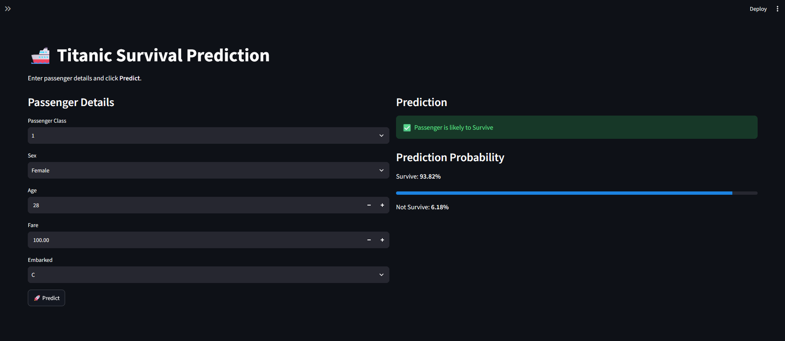

🚢 Overview

This project predicts whether a passenger would have survived the Titanic disaster using Logistic Regression.

The application is built with Python, Scikit-Learn, and Streamlit and allows users to enter passenger details through an interactive web interface.

✨ Features
Interactive Streamlit Web App
Logistic Regression Model
Data Cleaning & Preprocessing
Missing Value Handling
One-Hot Encoding
Model saved using Joblib
Prediction Probability
Professional UI
Responsive Layout

📊 Features Used
Passenger Class
Sex
Age
Fare
Embarked

🤖 Model

Algorithm used:
Logistic Regression

Model Accuracy:
~80%